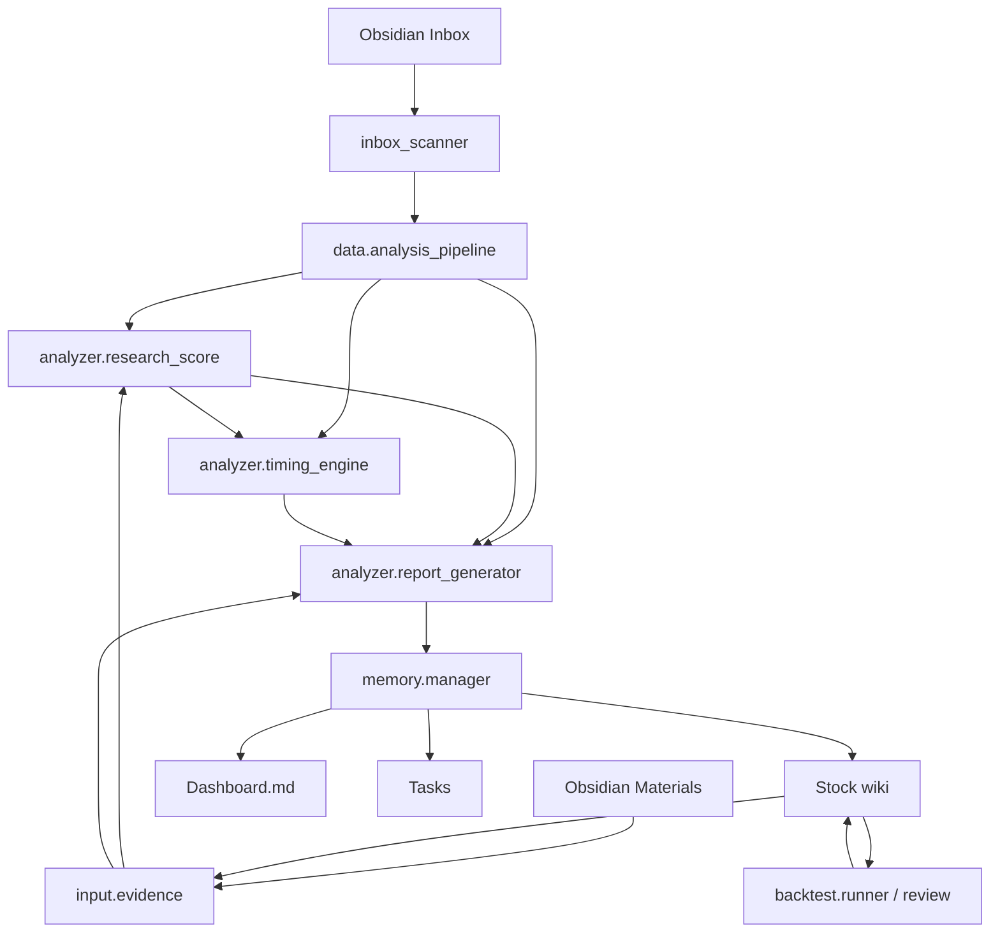

# Architecture

trader-obsidian is an Obsidian-native research pipeline. Python collects and structures data; Claude Code or an MCP client performs reasoning; `MemoryManager` persists the result into Markdown.

## Components



## Main Paths

| Path | Role |
|---|---|
| `scripts/analyze_stock.py` | one-click Cockpit analysis and Obsidian write |
| `run_analysis.py` | data fetch, scan/dashboard commands, write helpers |
| `data/analysis_pipeline.py` | one-call data pipeline |
| `input/evidence.py` | extracts typed evidence from wiki, Materials, Inbox |
| `analyzer/research_score.py` | five-dimension research score |
| `analyzer/timing_engine.py` | trade-timing state machine |
| `analyzer/report_generator.py` | final Markdown report |
| `memory/manager.py` | wiki/Materials/index/log persistence |
| `backtest/runner.py` | timeline signal parsing and verification |
| `backtest/review.py` | scheduled review workflow |
| `backtest/framework_analyzer.py` | weekly review pattern analysis and framework suggestions |
| `trader_mcp.py` | MCP server entry point |
| `telegram_bot.py` | optional Telegram command interface |
| `inbox_watcher.py` | optional filesystem watcher |

## Data Pipeline

`generate_analysis(code)` returns a dict with these top-level fields when available:

| Field | Source |
|---|---|
| `wiki_status`, `wiki_summary` | `MemoryManager.get_stock_context()` |
| `stock_info` | `DataManager.get_stock_info()` |
| `fundamentals` | `DataManager.get_fundamentals()` |
| `earnings` | `data.earnings.EarningsCalendar` |
| `technicals` | local MA/RSI/MACD/KDJ/Bollinger/support calculations |
| `wyckoff` | `analyzer.wyckoff.WyckoffAnalyzer` |
| `liquidity` | `data.liquidity.LiquidityAnalyzer` |
| `options` | `data.options.OptionsAnalyzer` |
| `web_search` | `data.search.StockSearchEngine` |
| `peers` | `data.correlation.CorrelationAnalyzer` |
| `etf` | `data.etf.ETFAnalyzer`, only when symbol is detected as ETF |

Each stage catches local failures and emits a `*_error` key instead of aborting the entire pipeline.

## Cockpit Analysis Flow

`scripts/analyze_stock.py` is the canonical full local workflow:

1. Fetch all pipeline data.
2. Enrich moat details through `FundamentalAnalyzer` when possible.
3. Generate a Wyckoff chart at `WIKI_BASE_DIR/Charts/{CODE}_wyckoff.png`.
4. Load saved Materials, prior stock wiki and related Inbox items.
5. Extract evidence with `EvidenceExtractor`.
6. Build a `ResearchScore` with `ResearchScoreEngine`.
7. Build a `TimingState` with `TimingEngine`.
8. Compare current score/timing with prior wiki timeline if available.
9. Generate Markdown with `ReportGenerator`.
10. Persist via `write_analysis_to_obsidian()`.

## Research Score

`ResearchScoreEngine` outputs base and evidence-adjusted five-dimension scores.

| Dimension | Weight |
|---|---:|
| 行业/TAM | 20% |
| 护城河 | 20% |
| 增长质量 | 20% |
| 估值 | 25% |
| 团队/治理 | 15% |

Evidence can adjust dimension scores when source credibility and impact rules support it. Rumors and low-credibility opinions are marked as `watch_only` or confidence-only and should not become hard score upgrades.

## Timing State

`TimingEngine` intentionally answers a different question from Research Score.

Inputs include:

- technical trend, RSI, volume ratio
- Wyckoff phase/support/resistance
- price distance to MA/support/analyst target
- earnings window
- liquidity and short-interest risk
- sentiment crowding and Put/Call ratio
- Research Score as a guardrail

Output states:

| State | Use |
|---|---|
| `Ready` | actionable setup |
| `Wait` | thesis may be valid, but wait for trigger |
| `Watch` | low-confidence monitor state |
| `Avoid` | risk/reward or thesis quality too weak |

## Wiki Persistence Model

`MemoryManager.init_stock_wiki()` creates a stock page with the standard `memory.manager.WIKI_SECTIONS` structure, including evaluation, Cockpit, event, earnings, liquidity, options, insider, SBC/dilution, KOL, sentiment, notes, cross-reference and material-index sections. Current Cockpit sections are replaced on each analysis:

- `证据表`
- `五维打分`
- `交易时机状态`
- `与上次分析相比`

Longitudinal sections are append-only:

- `分析时间线`
- `预测验证`
- `研究笔记`
- `资料索引`

The timeline supports both legacy entries and new Cockpit entries:

```text
- **YYYY-MM-DD HH:MM** | 价格: 123.45 | Research: 68.0/100 | Timing: Wait | 类型: Cockpit 分析
  - 核心观点: ...
  - 触发条件: ...
```

## Backtest Model

`BacktestRunner.backtest_wiki_timeline()` parses timeline entries older than the selected holding window. If `Timing: Ready`, it turns the core view into a synthetic BUY signal; legacy BUY/SELL/HOLD words are also parsed. Results are appended to `预测验证`.

`ReviewScheduler` wraps this into a full review run and generates Markdown/CSV/chart artifacts under `output/`.

`FrameworkAnalyzer` consumes weekly review results to identify repeat failure patterns, write `Analysis/复盘_YYYYMMDD.md`, and create a review task for framework suggestions.

## Interfaces

| Interface | Entry | Notes |
|---|---|---|
| CLI one-click analysis | `python scripts/analyze_stock.py AAPL` | writes full report |
| CLI data fetch | `python run_analysis.py AAPL` | prints JSON for Claude Code |
| MCP | `python trader_mcp.py` | exposes scan/context/write/search tools |
| Telegram | `python telegram_bot.py --polling` | `/note`, `/get`, `/scan`, `/inbox`, `/task` |
| Watcher | `python inbox_watcher.py` | watches Inbox/Clippings/Raw for new Markdown |
| Scheduler | `python scheduler.py` or OS scheduler | periodic scan/review/dashboard |
| Weekly review | `python scripts/weekly_review.py` | framework suggestions from aggregate backtest results |
| Podwise import | `python scripts/podwise_sync.py` | imports podcast notes as Obsidian material |
